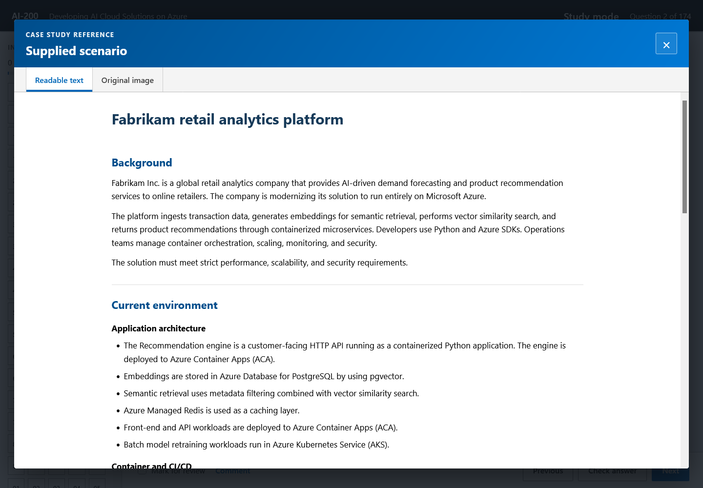

# AI-200 preparation

Persoonlijke studieomgeving voor **Microsoft AI-200: Developing AI Cloud Solutions on Azure**. De repository bevat compacte Nederlandstalige lesnotities, een labtracker, examenvoorbereiding en een Engelstalige oefenapp.

## Inhoud

- `kennisbank/00-overzicht.md` — ingang naar alle aantekeningen.
- `kennisbank/01-lesnotities.md` — doorlopende cursusnotities.
- `kennisbank/03-examenplan.md` — leerplan en examenstrategie.
- `kennisbank/04-labtracker.md` — voortgang van de 24 verplichte labs.
- `kennisbank/14-officiele-examengap-analyse.md` — dekking tegenover de officiële studiegids.
- `kennisbank/17-online-oefenvraagbronnen.md` — beoordeling van openbare oefenbronnen.
- `ai-200-practice-exam/` — Engelstalige simulator met 263 gecontroleerde vragen en een afzonderlijke set van 174 door de docent verstrekte voorbeeldvragen.

Open `ai-200-practice-exam/dist/index.html` lokaal in een browser om de simulator te gebruiken. `Official exam flow` mengt standaard de gecontroleerde vraagbank met de docentenset. Via de bronkeuze kun je ook uitsluitend de gecontroleerde bank of uitsluitend de docentenset gebruiken. De volledige docentenset is daarnaast apart beschikbaar.

## Screenshots

### Startscherm

### Examenvraag met timer en navigatie

### Case study met informatietabbladen

### Supplied scenario als leesbare tekst en origineel beeld

## Privacy en AVG

- De repository bevat geen namen van cursisten, privé-e-mailadressen, telefoonnummers, labaccounts, tijdelijke toegangscodes of ingevulde persoonlijke formulieren.
- De oefenapp vraagt niet om een naam, e-mailadres of andere persoonsgegevens.
- De zelfstandige browserversie bewaart alleen oefenresultaten in lokale browseropslag. Deze gegevens worden niet door de app naar een server verzonden.
- Vrije opmerkingen bij vragen blijven binnen de actieve browsersessie.
- Voeg nooit `.env`-bestanden, Azure-aanmeldgegevens, TAP-tokens, API-sleutels of exports met persoonsgegevens toe.

Zie ook `PRIVACY.md`.

## Bronnen en status

De applicatie is een onafhankelijk studiemiddel en geen officieel Microsoft-product. De gecontroleerde vraagbank bevat 133 openbaar gepubliceerde Microsoft Learn-moduletoetsvragen met bronvermelding. De afzonderlijke docentenset bevat 174 aangeleverde voorbeeldvragen. Alle 174 gebruiken native tekst en bediening; de 48 oorspronkelijke hot-area-vragen zijn omgezet naar selectierasters en codeblokken. Na visuele dubbelcontrole kan de app alle 174 docentvragen automatisch nakijken. De oorspronkelijke Word-bestanden, antwoordschermen en persoonsgegevens zijn niet gepubliceerd.

Het lokale bestand `bron-oefenvragen.pdf` wordt daarom niet gepubliceerd. De bruikbare beoordeling ervan staat zonder gekopieerde vraagbank in `kennisbank/15-oefenvragen-bronbeoordeling.md`.

Belangrijkste bronnen:

- https://learn.microsoft.com/en-us/credentials/certifications/resources/study-guides/ai-200
- https://learn.microsoft.com/en-us/credentials/certifications/azure-ai-cloud-developer-associate/
- https://learn.microsoft.com/en-us/training/courses/ai-200t00
- https://microsoftlearning.github.io/mslearn-azure-ai/

Azure-diensten en examendoelen veranderen. Controleer vlak voor het examen altijd de actuele officiële studiegids.

## Disclaimer

Microsoft, Azure en de bijbehorende productnamen zijn handelsmerken van Microsoft. Deze repository is niet verbonden aan of goedgekeurd door Microsoft of Pearson VUE.
